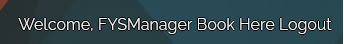

# Find Your Shape - The Fitness Class System

## Introduction

Welcome to the fourth project; the FSD project.

I have decided to create an app that would be used by a Gym and its members to Create, Read, Update and Edit Assessments and Personal Training sessions, while also allowing
the management of the gym to Create, Read and Update classes ran by the gym on a daily basis. 

A Live website can be found here:

# Table of Contents

- [1. UX](#ux)
    - [1.1 Strategy](#strategy)
        - [Project Goals](#project-goals)
        - [User Goals](#user-goals)
        - [User Expectations](#user-expectations)
    - [1.2 Structure](#12-structure)
    - [1.3 Skeleton](#13-skeleton)
    - [1.4 Surface](#14-surface)
- [2. Features](#2-features)
- [3. Technology Used](#3-technologies-used)
- [4. Testing](#4-testing)
- [5. Development Cycle](#5-development-cycle)
- [6. Deployment](#6-deployment)
- [7. End Project](#7-end-project)
- [8. Known Bugs](#8-bugs)
- [9. Credits](#9-credits)

<a name='ux'></a>

# 1 UX

[Go To Top](#table-of-contents)

As someone who goes to the gym five to six times a week, I do sometimes find myself wishing I knew when the staff might be avalible to answer a question or help out with 
a personal best. 

Sometimes I want to be able to set up an appointment with my trainer without having to drive to the gym, or call them and get nothing done. 

This project will showcase simplicity and ease of function when it comes to creating an appointment, updating an appointment, canceling an appointment and allowing Management to do the same. 

## 1.1 Strategy

[Go to Top](#table-of-contents)

### Project Goals

The main goal of this project is to allow the user to sign up, sign in/out and then Create, Read, Update and Delete their appointments. 

### User Goals:
First Time User Goals:
- As a First time User I want to be able to understand the sign up instructions
- as a First time User I want to be able to simply and easily navigate the app.

Regular User Goals: 
- As a Regular User I want to be able to edit my appointments to suit my schedule.
- As a Regular User I want to be able to cancel an appointment I've made

### User Expectations
The App should have a siomple user interface, with navigation to each section clear and concise

- The Log in menu is clear and simple with good User Feedback
- Creating, editing, deleting an item should return feedback to the user to confirm actions

## 1.2 Structure

[Go To Top](#table-of-contents)

It is important in all aspects of modern web design that you provide a responsive and sleek look to an application in order to make it as user friendly as possible.

- Responsive on all device sizes
- Easy Navigation
- Footer at the bottom with social media websites
- All elements will be consistant with font size, font family and colour scheme. 

<a name='skeleton'></a>

## 1.3 Skeleton

Database Structure: 

```python
class hiitbook(models.Model):
    name = models.CharField(max_length=10, null=False, blank=False)
    focus = models.CharField(max_length=50, null=False, blank=False)
    time = models.DateTimeField(max_length=10)

    def __str__(self):
        return self.name


class SpinClasses(models.Model):
    name = models.CharField(max_length=10, null=False, blank=False)
    genre = models.CharField(max_length=10, null=False, blank=False)
    time = models.DateTimeField(max_length=10)

    def __str__(self):
        return self.name


class hittclasses(models.Model):
    name = models.CharField(max_length=10, null=False, blank=False)
    trainer = models.CharField(max_length=10, null=False, blank=False)
    focus = models.CharField(max_length=50, null=False, blank=False)

    def __str__(self):
        return self.name


class PtClasses(models.Model):
    name = models.CharField(max_length=10, null=False, blank=False)
    trainer = models.CharField(max_length=10, null=False, blank=False)
    focus = models.CharField(max_length=50, null=False, blank=False)
    time = models.DateTimeField(null=False, blank=False)

    def __str__(self):
        return self.name
```

<a name='surface'></a>

## 1.4 Surface

### Colours

Please find the colours I used [here](https://coolors.co/000000-ffd700-e7e4e4-7b3f00-0000ff)

### Typography

I went with two seperate fonts; Oswald for Headings with Raleway used for everything else. 

You can find [Oswald](https://fonts.google.com/specimen/Oswald) And [Raleway](https://fonts.google.com/specimen/Raleway) at these links

<a name='features'></a>

# 2. Features

[Go To Top](#table-of-contents)

### All Pages
- The nav bar is placed at the top of the two major pages, and is dynamic. Meaning that the options will change depending on if the user is logged in
- The nav bar looks like this when the user is not logged in:



- The nav bar looks like this when the user is logged in:


- A modern, sleek background image to provide a unique image and pleasent user experiance. 

### Register Page

- Simple Sign up form
- A message will prompt the user if they've signed up correctly. 
- Once the user is successfully signed up, they will automatically be logged in and directed to the booking page.


### Log In Page

- A log in form that requires the username and password of a user
- A message prompt will confirm the log in. 


### Landing Page

- A welcoming page that introduces Find Your Shape, tells the user what the gyms goals are 
- The Nav bar requires the user to log in or register to be able to availe of the apps services


### Booking page

- A list of classes that the user can attend
- An option to book a Personal Training session, with a form and messages to confirm the booking
- An option to book an assessment, with a form and messages to confirm the booking


- Users can only edit bookings and assessments


### Editing Page

- Pre populating fields that allow for ease of editing
- Applies to all classes and appointments


### Delete Function

- Clicking the button deletes the item from the DB. 

<a name='technology-used'></a>


## 3. Technologies Used

[Go To Top](#table-of-contents)

-   [HTML5](https://en.wikipedia.org/wiki/HTML)
    -   The project uses HyperText Markup Language.
-   [CSS3](https://en.wikipedia.org/wiki/CSS)
    -   The project uses Cascading Style Sheets.
-   [Python](https://en.wikipedia.org/wiki/Python_(programming_language))
    -   The project uses Python.
-   [Boostrap 5](https://getbootstrap.com/docs/5.0/getting-started/introduction/)
    -   The project uses Bootstrap 5.
-   [PostgreSQL](https://www.postgresql.org/)
    -   The project uses PostgreSQL as a database.
-   [Gitpod](https://www.gitpod.io/)
    -   The project uses Gitpod.
-   [Chrome](https://www.google.com/intl/en_uk/chrome/)
    -   The project uses Chrome to debug and test the source code using HTML5.
-   [Balsamiq](https://balsamiq.com/)
    -   Balsamiq was used to create the wireframes during the design process.
-   [Google Fonts](https://fonts.google.com/)
    -   Google fonts were used to import the "Be Vietnam Pro" font into the style.css file which is used on all pages throughout the project.
-   [GitHub](https://github.com/)
    -   GitHub was used to store the project's code after being pushed from Git.

<a name="testing"></a>

# 4. Testing

[Go to Top](#table-of-contents)

### Google Developer Tools
For every element that I added to my HTML, I would add the basic CSS to my stylesheet. I would then use the inspect element to try different styles. Once I've got it to my liking I would try to see if I can implement the styling with bootstrap, if I could not replicate the styling I would copy the CSS from google and paste it into my CSS stylesheet. This allows me to keep track of the code I am using.

I also checked the accessibility of the page using lighthouse.

### Responsive Tools

I used [Am I Responsive](http://ami.responsivedesign.is) to make sure that all my pages are responsive to all devices

## Manual Testing
I have tested my site on Safari and google chrome on multiple devices.

These include:
-   iPhone X
-   iPhone XS Max
-   iPad Pro
-   Lenovo Legion
-   Samsung Galaxy S8+ 

Please find below my testing process for all pages via mobile and web:

### Navigation Bar

All Pages:
TEST            | OUTCOME                          | PASS / FAIL  
--------------- | -------------------------------- | ---------------
Home page | When clicking on the "Home" button on the nav bar, the browser redirects to the home page. | PASS
Booking Page | When clicking on the booking button on the nav bar, the browswer redirects to the booking page | PASS
Edit Pages | When Clicking on the edit button for any class or assessment, the browswer redirects to the correct editing page | PASS
Loging/ Log Out Pages | When clicking on the log in or log out button the page redirects to the log in page or logs the user out | PASS
Register Page | When clicking on the register button it redirects to the register page. | PASS
Foreground and background | Checked foreground and background information is clearly legible | PASS
Text | Checked the text is clearly legible against the background | PASS

### Home Page
TEST            | OUTCOME                          | PASS / FAIL  
--------------- | -------------------------------- | ---------------
Responsiveness | Checked elements for consistant scaleability | PASS
Accessibility | Checked the accessibility of the page using lighthouse | PASS

### Booking page
TEST            | OUTCOME                          | PASS / FAIL  
--------------- | -------------------------------- | ---------------
Responsiveness | Checked elements for consistant scaleability | PASS
Book now button | When clicking the book now button on the page, the browser redirects to the booking page. | PASS
Booking Form | Checked the form submits only when all required fields are filled out. | PASS
Accessibility | Checked the accessibility of the page using lighthouse| PASS

### Edit booking page
TEST            | OUTCOME                          | PASS / FAIL  
--------------- | -------------------------------- | ---------------
Media | All media assets are displayed properly, have no pixelation or stretched images and is responsive on all devices. | PASS
Responsiveness | Check every element on-page for consistent scalability in mobile, tablet and desktop view.| PASS
Accessibility | Checked the accessibility of the page using lighthouse| PASS
Edit Booking Form | Checked the form submits only when all required fields are filled out. | PASS

### Register page
TEST            | OUTCOME                          | PASS / FAIL  
--------------- | -------------------------------- | ---------------
Media | All media assets are displayed properly, have no pixelation or stretched images and is responsive on all devices. | PASS
Responsiveness | Check every element on-page for consistent scalability in mobile, tablet and desktop view.| PASS
Accessibility | Checked the accessibility of the page using lighthouse| PASS
Register form | Checked the form submits only when all required fields are filled out. | PASS
Sign in link | Checked the sign-in link redirects to the sign-in page. | PASS

### Sign in Page

TEST            | OUTCOME                          | PASS / FAIL  
--------------- | -------------------------------- | ---------------
Media | All media assets are displayed properly, have no pixelation or stretched images and is responsive on all devices. | PASS
Responsiveness | Check every element on-page for consistent scalability in mobile, tablet and desktop view.| PASS
Accessibility | Checked the accessibility of the page using lighthouse| PASS
Sign in form | Checked the form submits only when all required fields are filled out. | PASS
Signup link | Checked the signup link redirects to the signup page. | PASS

### Validator Tools
#### HTML

Using Code Insitutes Heroku app  to check; No Errors are returned from the checker after running all HTML files through it. 

#### CSS

Using  To check my Custom CSS elements, it passes with no errors.

#### Python 

Using Code Insitutes Heroku app  to check;

- There are some Line Too Long errors in Settings.py, which I am not going to change.

Other than that, all files come back clean. 

# 5. Development Cycle

[Go to the top](#table-of-contents)

## Project Checklist
- Install Django and the supporting libraries
    -  Install Django and Gunicorn. Gunicorn is the server I am using to run Django on Heroku.
    - Install support libraries including psycopg2, this is used to connect the PostgreSQL database
    - Install Cloudinary libraries, this is a host provider service that stores images
    - Create the requirements.txt file. This includes the project's dependencies allowing us to run the project in Heroku.

- Create a new, blank Django Project
    - Create a new project
    - Create the app
    - Add home to the installed apps in settings.py
    - Migrate all new changes to the database
    - Run the server to test

- Setup project to use Cloudinary and PostgreSQL
    - Create new Heroku app
        - Sign into Heroku
        - Select New
        - Select create new app
        - Enter a relevant app name
        - Select appropriate region
        - Select the create app button

    - Attach PostgreSQL database
        - In Heroku go to resources
        - Search for Postgres in the add-ons box
        - Select Heroku Postgres
        - Submit order form

    - Prepare the environment and settings.py file
        - Create env.py file
        - Add DATABASE_URL with the Postgres URL from Heroku
        - Add SECRET_KEY with a randomly generated key
        - Add SECRET_KEY and generated key to the config vars in Heroku
        - Add if statement to settings.py to prevent the production server from erroring
        - Replace insecure key with the environment variable for the SECRET_KEY
        - Add Heroku database as the back end
        - Migrate changes to new database

    - Get static media files stored on Cloudinary
        - Create a Cloudinary account
        - From the dashboard, copy the API Environment variable
        - In the settings.py file create a new environment variable for CLOUDINARY_URL
        - Add the CLOUDINARY_URL variable to Heroku
        - Add a temporary config var for DISABLE_COLLECTSTATIC
        - In settings.py add Cloudinary as an installed app
        - Add static and media file variables
        - Add templates directory
        - Change DIR's key to point to TEMPALTES_DIR
        - Add Heroku hostname to allowed hosts
        - Create directories for media, static and templates in the project workspace
        - Create a Procfile

- Deploy new empty project to Heroku

<a name="deployment"></a>

# 6. Deployment

[Go to the top](#table-of-contents)

I used the terminal to deploy my project locally. To do this I had to:
1. Create a repository on GitHub.
2. Clone the repository on your chosen source code editor (GitPod in my case) using the clone link.
3. Open the terminal within GitPod
4. Enter "python3 manage.py runserver into the terminal.
5. Go to local host address on my web browser.
6. All locally saved changes will show up here.

For the final deployment to Heroku, I had to:
1. Uncomment the PostgreSQL databse from my settings.py file.
2. Set debug = False in my settings.py file.
3. Commit and push all files to GitHub
3. In Heroku, remove the DISABLE_COLLECTSTATIC config var.
4. In the deploy tab, go to the manual deploy sections and click deploy branch.

<a name="known-bugs"></a>

# 8. Known Bugs

[Go to the top](#table-of-contents)

# 9. Credits

[Go to the top](#table-of-contents)

### Code

- The Navigation Bar came from [Bootstrap](https://getbootstrap.com/docs/5.0/components/navbar)

### Content

- The Background image came from [Vecteezy](https://www.vecteezy.com/vector-art/1849553-modern-gold-background)

### Project Acknowledgements
- My Mentor - For his constructive criticism and always pushing me to go further to develop my skills.